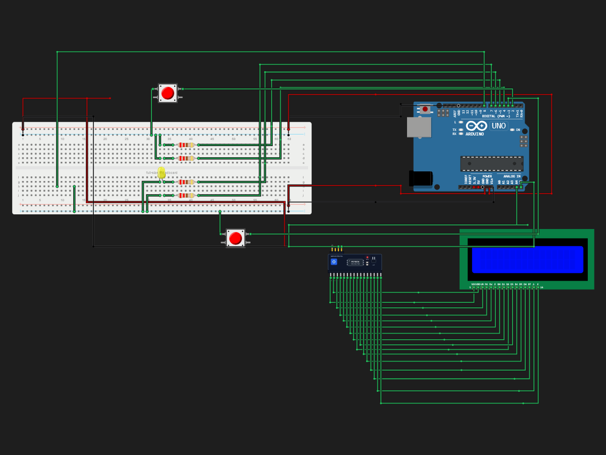

# Reflex Duel

> Built in [Breadboard](https://breadboard.hackclub.com), a Hack Club program. This project took ~1.4 hours of work.

## What It Does

A reaction game to play with a friend to see who's reaction time a faster.

## How It Works

The circuit is captured in `breadboard-project.json`, and the firmware that runs it is in the `firmware/` folder.

## How To Use It

Connect the Wiring and upload the firmware to the ARDUINO and play with your friend

## Demo

- **Simulate it live:** [https://breadboard.hackclub.com/share/164](https://breadboard.hackclub.com/share/164), runs the firmware in the Breadboard simulator
- **View the design:** [https://taniwankenobi.github.io/breadboard-plays/p/164/](https://taniwankenobi.github.io/breadboard-plays/p/164/)

## Schematic

The editor snapshot is in `breadboard-project.json`.

## Bill of Materials

| Part | Quantity |
| --- | --- |
| breadboard-full | 1 |
| buzzer-passive | 1 |
| lcd1602 | 1 |
| lcd1602-i2c | 1 |
| led-blue | 1 |
| led-red | 2 |
| led-yellow | 1 |
| pushbutton | 2 |
| resistor-220 | 4 |

## Firmware

Firmware files are in the `firmware/` folder.

## Build Journal

Build journal entries are kept in [`journals.md`](journals.md).

---

*Made in [Breadboard](https://breadboard.hackclub.com) — 1.4h of work*

